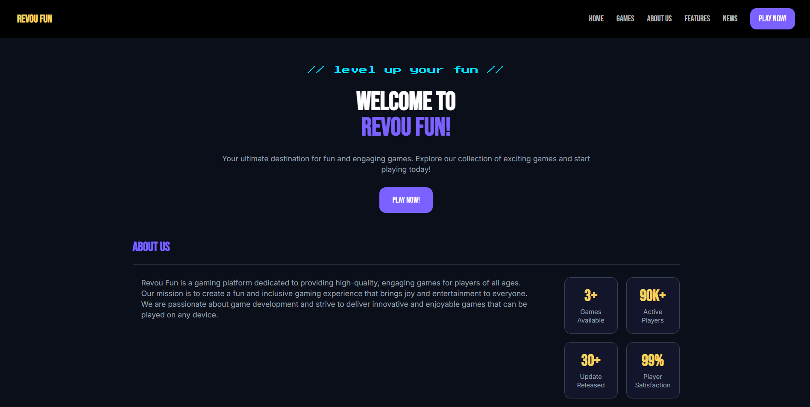
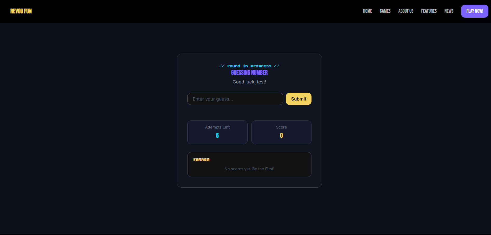
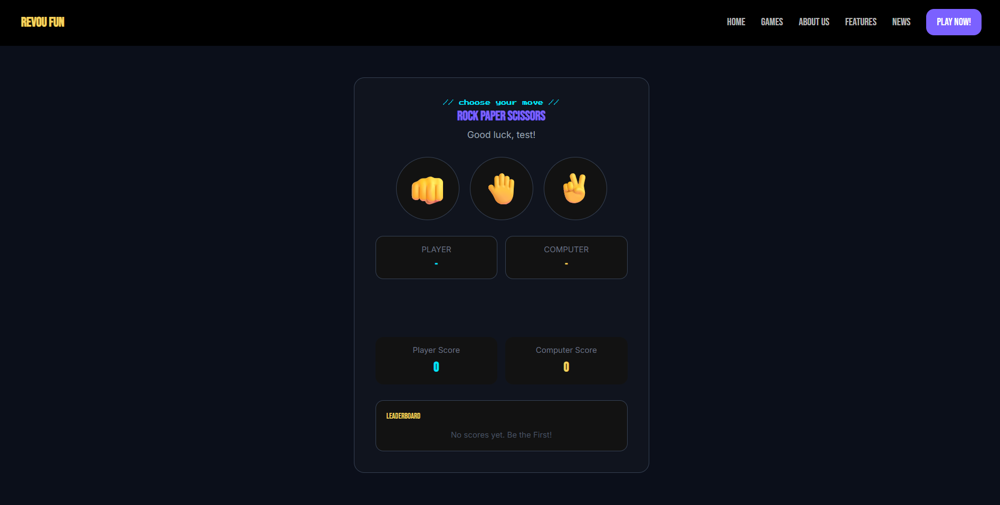
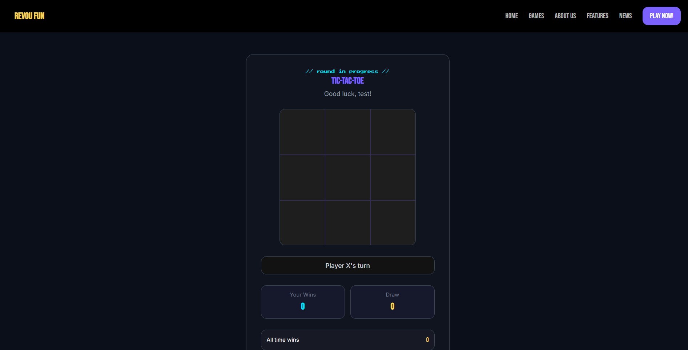
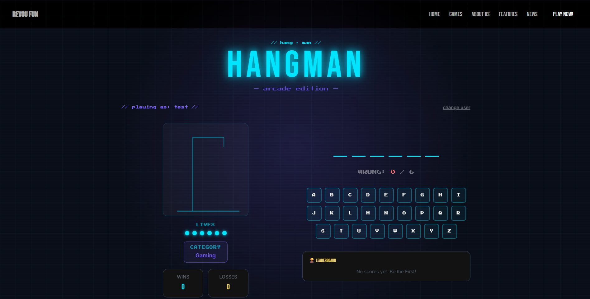
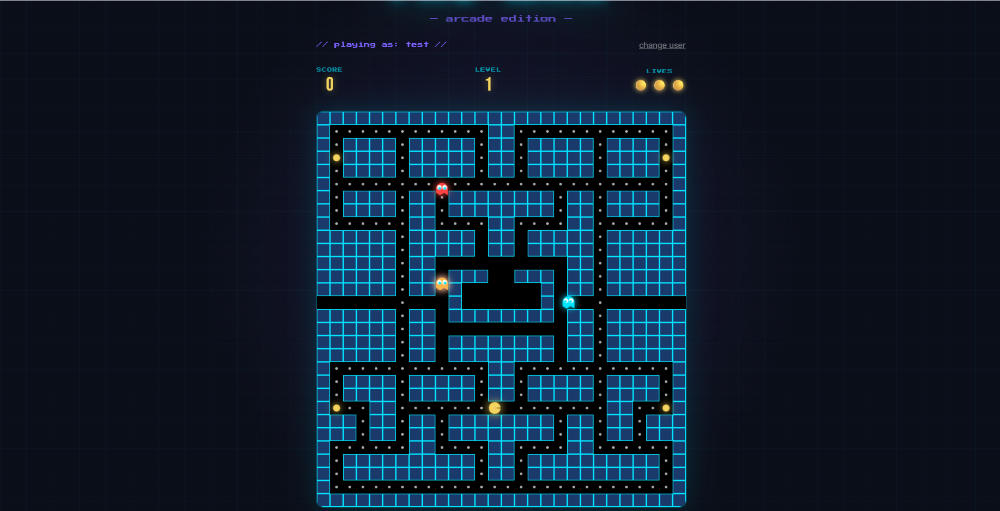

# RevouFun

> A collection of classic mini-games built with vanilla JavaScript and TypeScript, styled with Tailwind CSS.

---

## Overview

RevouFun is a web-based gaming platform featuring three classic games — Tic-Tac-Toe, Rock Paper Scissors, Number Guessing, Hangman, and Pacman. Each game includes a nickname system, live leaderboard powered by localStorage, and a unified dark gaming aesthetic built with a custom design system.

This project was built as part of a front-end development assignment focusing on JavaScript/TypeScript fundamentals, DOM manipulation, and responsive UI design.

---

## Games

### Number Guessing Game
Guess a randomly generated number between 1 and 100. You have 5 attempts — each wrong guess gives you a hint whether the number is higher or lower. Score a point every time you guess correctly!

### Rock Paper Scissors
Classic hand game against the computer. The computer picks randomly — outsmart it to rack up wins and climb the leaderboard!

### Tic-Tac-Toe
Two-player strategy game on a 3×3 grid. Get 3 in a row horizontally, vertically, or diagonally to win. Winning cells are highlighted and your win count is tracked on the leaderboard.

### Hangman
Guess the hidden word one letter at a time before the hangman is fully drawn. Each wrong letter brings you closer to the end — how many words can you save?

### Pacman
Navigate the maze, eat all the pellets, and avoid the ghosts. A browser-based take on the arcade classic built with TypeScript.

---

## Features

- **5 fully playable games** with interactive JavaScript gameplay
- **Nickname system** — enter your name before playing
- **Leaderboard** — top 5 scores saved per game using localStorage
- **Responsive design** — works on desktop and mobile
- **Dark gaming theme** — consistent design system across all pages
- **Custom font pairing** — Orbitron for headings, Poppins for body
- **Accent colors** — Neon Blue, Purple Glow, and Yellow Brand
- **Back to Home** navigation on all game pages

---

## Tech Stack

| Technology | Usage |
|---|---|
| HTML5 | Page structure and semantic markup |
| Vanilla JavaScript | Game logic, DOM manipulation, localStorage |
| Vanilla TypeScript | Game logic |
| Tailwind CSS v4 (CDN) | Styling and responsive layout |
| Google Fonts | Bebas Neue, Inter, Press Start 2P |

---

## Design System

| Token | Value | Usage |
|---|---|---|
| Yellow Brand | `#F4D35E` | Primary CTAs, headings, highlights |
| Deep Dark Blue | `#0B0F1A` | Page background |
| Cyan | `#00E5FF` | Accents, Player X color |
| Purple Glow | `#7B61FF` | Accents, Player O color |

---

## Project Structure

```
revou-fun/
├── index.html                  # Main landing page
├── pages/
│   ├── guessingNumber.html     # Number Guessing Game page
│   ├── rockPaperScissors.html  # Rock Paper Scissors page
│   ├── ticTacToe.html          # Tic-Tac-Toe page
│   ├── hangman.html            # Hangman page
│   └── pacman.html             # Pacman page
├── js/
│   ├── header.js               # Header logic
│   ├── footer.js               # Footer logic
│   ├── nav.js                  # Nav logic
│   ├── leaderboard.js          # Leaderboard logic
│   ├── username.js             # Username logic
│   ├── guessingNumber.js       # Number Guessing Game logic
│   ├── rockPaperScissors.js    # Rock Paper Scissors logic
│   └── ticTacToe.js            # Tic-Tac-Toe logic
├── ts/
│   ├── hangman.ts              # Hangman logic
│   └── pacman.ts               # Pacman logic
├── css/
│   ├── hangman.css              # Hangman style
│   └── pacman.css               # Pacman style
├── assets/
│   ├─ GuessNumber.png          # image of guess number
│   ├─ rps.png                  # image of rock paper scissors
│   ├─ tictactoe.png            # image of tic tac toe
│   ├─ hangman.png              # image of hangman
│   ├─ pacman.png               # image of pacman
│   └── index.png               # image of index
│
├── .gitignore
├── package-lock.json
├── package.json
├── tsconfig.json
└── README.md
```

---

## How to Run

No installation or build step required — this project runs entirely in the browser.

**Option 1 — Open directly:**
1. Clone or download this repository
2. Open `index.html` in your browser

**Option 2 — Using Live Server:**
1. Install the [Live Server](https://marketplace.visualstudio.com/items?itemName=ritwickdey.LiveServer) extension in VS Code
2. Right-click `index.html` → **Open with Live Server**
3. The site will open at `http://127.0.0.1:5500`

**Option 3 — Using Live Demo Link (recommended):**
1. click the demo link at `https://revou-fsse-feb26.github.io/milestone-2-satria/`

---

## Screenshots

| Page | Preview |
|---|---|
| Home |  |
| Number Guessing |  |
| Rock Paper Scissors |  |
| Tic-Tac-Toe |  |
| Hangman |  |
| Pacman |  |


---

## localStorage Keys

Each game stores its leaderboard separately:

| Game | Key |
|---|---|
| Number Guessing | `guessingLeaderboard` |
| Rock Paper Scissors | `rpsLeaderboard` |
| Tic-Tac-Toe | `tttLeaderboard` |
| Hangman | `hangman_leaderboard` |
| Pacman | `pacman_leaderboard` |

To reset a leaderboard, open DevTools → Console and run:
```javascript
localStorage.removeItem("guessingLeaderboard") // or rpsLeaderboard / tttLeaderboard
localStorage.clear() // clears all three at once
```

---

## Credits

**Developed by:** Satria Pamungkas

Built as part of the **Revou Front-End Development** course assignment.

---

## License

This project is for educational purposes only.


[](https://classroom.github.com/a/1g1UC-tA)
